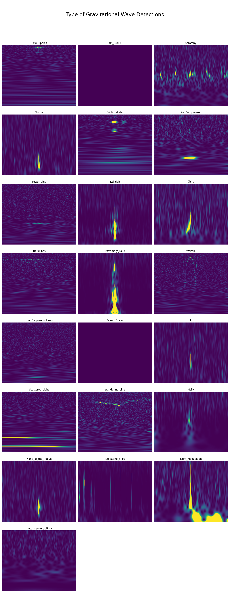
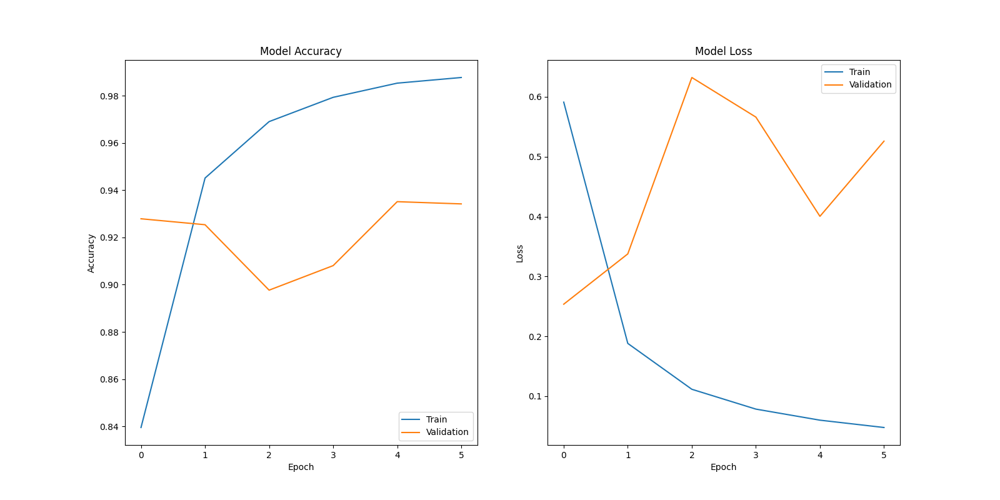
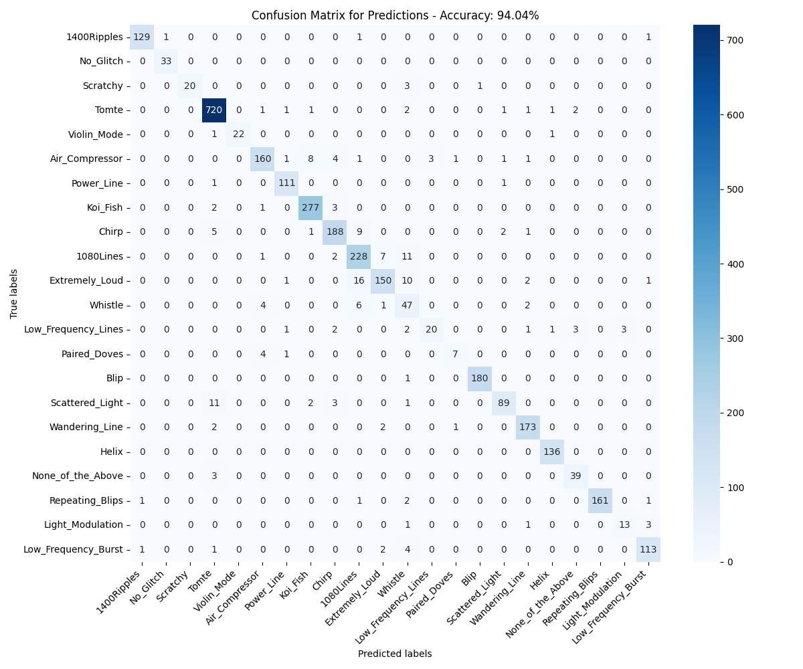

# PyWaveCNN

## Contents
- [Overview](#overview)
- [Technical Features](#technical-features)
- [Machine Learning Models](#machine-learning-models)
- [File Description](#file-description)
- [Usage](#usage)
- [Output](#output)
- [References](#references)

## Overview

Gravitational Wave Classification CNN is an advanced convolutional neural network (CNN) project, leveraging TensorFlow to analyse and categorise various types of gravitational wave data represented in contour plots. The project aims to facilitate the understanding and classification of these gravitational wave forms using machine learning techniques.

## Technical Features

- **TensorFlow and Keras Integration:** Gravitational Wave Classification CNN is built using TensorFlow and its high-level API, Keras. This integration enables efficient modeling and training of the CNN.
- **Convolutional Neural Network Implementation:** Utilising layers like `MaxPooling2D` and `Conv2D`, the project creates a CNN capable of extracting features from contour plots of gravitational waves.
- **Model Optimisation:** The project employs the `RMSProp` optimiser from Keras.
- **Parallel Computing:** Uses the python library `multiprocessing` to perform data processing efficiently. Without `multiprocessing` each class would have their figures cropped one at a time. However, `multiprocessing` allows for many workers to be assigned a class to crop. This significantly decrease the computational time. 

## Machine Learning Models

Gravitational Wave Classification CNN uses a CNN model designed specifically for the task of gravitational wave classification. The model includes several convolutional layers, max pooling layers, and dense layers, culminating in a softmax layer for multi-class classification.

## File Description

- `main.py`: The main script orchestrating the machine learning workflow, including data preprocessing, model training, and performance evaluation.
- `models.py`: Contains the CNN model's architecture and configuration.
- `plotter.py`: Manages the creation and rendering of plots derived from model performance and data analysis.
- `data_handler.py`: Downloaded and extracts the .tar.gz file needed to perform this analysis. This methodology greatly saves space in the repository due to the large amounts of data that is processed. This file also contains all the preprocessing steps needed in order for the CNN to function.

## Usage
To get started with PyWaveCNN, follow these steps:

1. **Set Up a Virtual Environment (Optional but Recommended)**:
	```
	python -m venv venv
	source venv/bin/activate  # On Windows, use 'venv\Scripts\activate'
	```
2. **Install Dependencies**:
	```
	pip install -r requirements.txt
	```

3. **Run the Application**:
	```
	python main.py
	```

## Output

The model processes gravitational wave data, offering insightful visualisations and performance metrics:

- **Data Visualisation:** The data can be visualised to show different types of gravitational waves, aiding in understanding the dataset complexity.
  
  

- **Model Performance Metrics:** Displays the accuracy and loss metrics over training epochs, offering insights into model convergence and overfitting.
  
  

- **Confusion Matrix:** Evaluates the model's predictive performance on unseen data, illustrating its precision and recall capabilities.
  
  

## References

Coughlin, S. (2018). Updated Gravity Spy Data Set (v1.1.0) [Data set]. Zenodo. [DOI:10.5281/zenodo.1476551](https://doi.org/10.5281/zenodo.1476551)

## [Back to Top](#PyWaveCNN)
